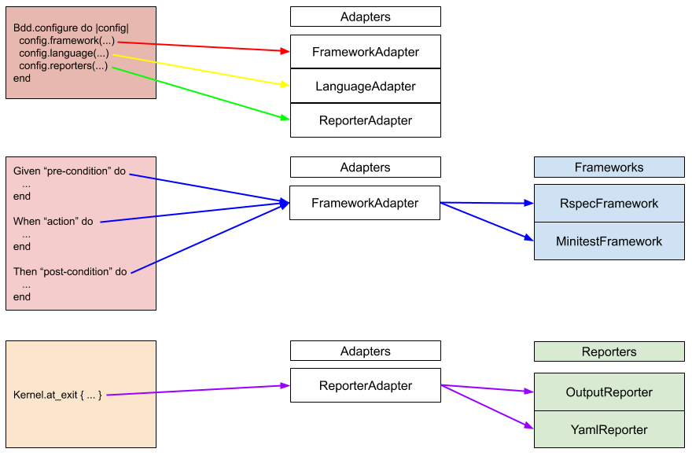

# Bdd

Bdd is a **User Story Framework**. Add Acceptance Criteria documentation directly on your Ruby Tests.


## Status

| Is It Working? | Is It Tested? | Code Quality | **# of Downloads** |  **Get Involved!** |
|:---|:---|:---|:---|:---|
| [](https://travis-ci.org/thejamespinto/bdd) | [](https://codeclimate.com/github/thejamespinto/bdd) | [](https://codeclimate.com/github/thejamespinto/bdd) | [](https://rubygems.org/gems/bdd) | [](https://github.com/thejamespinto/bdd/issues) |


## Compatibility

<image width=16 src='./images/ruby.png'> Ruby 2.0 through 2.7

## Pitch

<pre>
This gem provides the same benefits as gem <b>Cucumber</b>, and it's easier to use in projects.

Works with all ruby test frameworks (RSpec and Minitest).
Works with all test types (Capybara, units, features, etc).


1. Take your User Stories.

2. Write them as unobtrusive commentary in your test code.

3. Run your tests.

4. You'll see all your User Stories neatly organized in the output.

5. If your code breaks, that line will be highlighted in red.
</pre>

[Read more about User Stories on Wikipedia](https://en.wikipedia.org/wiki/User_story).


## Example

<table>
  <tr>
    <td style="vertical-align: top">
      <center><strong>1. BEFORE</strong></center>
      <p></p>
    </td>
    <td style="vertical-align: top">
      <center><strong>2. AFTER</strong></center>
      <p></p>
    </td>
  </tr>
  <tr style="background: white">
    <td style="vertical-align: top">
      <center><strong>3. RUN TESTS</strong></center>
      <p></p>
    </td>
    <td style="vertical-align: top">
      <center><strong>4. CHECK OUTPUT</strong></center>
      <p></p>
    </td>
  </tr>
</table>


## Installation


#### Installation For RSpec

```ruby
# Gemfile

group :development, :test do
  gem 'rspec'
  gem 'rspec-rails' # if you are using Rails
  gem 'bdd'
end
```

```ruby
# spec/spec_helper.rb
require 'bdd'

Bdd.configure do |config|
  config.framework :rspec
  config.reporters :output, :yaml
  config.language %w[Given], %w[When Then], %w[And But]

  # Optionally, add other languages:
  # config.language pre_conditions, post_conditions, conjunctions
  # config.language %w[Dado], %w[Quando Entao], %w[E Mas] # Portuguese
  # config.language %w[Dato], %w[Cuando Entonces], %w[Y Mas] # Spanish
  # config.language %w[Zakładając], %w[Jeśli To], %w[Także Ale] # Polish
end
```


#### Installation For Minitest

```ruby
# Gemfile

group :development, :test do
  gem 'minitest'
  gem 'minitest-rails' # if you are using Rails
  gem 'bdd'
end
```

```ruby
# test/test_helper.rb
require 'bdd'

Bdd.configure do |config|
  config.framework :minitest
  config.reporters :output, :yaml
  config.language %w[Given], %w[When Then], %w[And But]

  # Optionally, add other languages:
  # config.language pre_conditions, post_conditions, conjunctions
  # config.language %w[Dado], %w[Quando Entao], %w[E Mas] # Portuguese
  # config.language %w[Dato], %w[Cuando Entonces], %w[Y Mas] # Spanish
  # config.language %w[Zakładając], %w[Jeśli To], %w[Także Ale] # Polish
end
```


## Authors & Contributions

* [James Pinto](http://github.com/thejamespinto)
* [Michal Papis](http://github.com/mpapis)


## Contributing

1. Fork it ( https://github.com/thejamespinto/bdd/fork )
2. Create your feature branch (`git checkout -b my-new-feature`)
3. Commit your changes (`git commit -am 'Add some feature'`)
4. Push to the branch (`git push origin my-new-feature`)
5. Create a new Pull Request


## Documentation



- Frameworks
    - [x] RSpec
    - [x] Minitest
- Reporters
    - [x] Output
    - [x] YAML
    - [ ] HTML
